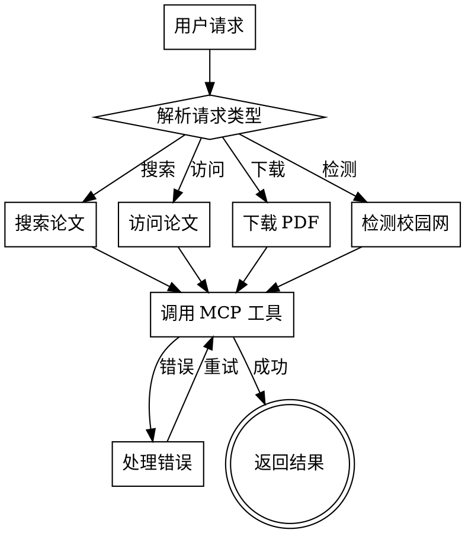

# 学术论文搜索 Skill

搜索学术论文并通过校园网访问机构订阅的付费资源。

## 功能

1. **学术论文搜索** - arXiv、PubMed、Google Scholar、bioRxiv 等
2. **校园网机构访问** - IEEE Xplore、ACM DL、SpringerLink、ScienceDirect、CNKI、万方
3. **论文 PDF 下载** - 自动利用校园网订阅权限
4. **自动错误修复** - 处理编码、虚拟环境、模块导入等常见问题

## MCP 服务器

本 skill 使用两个 MCP 服务器：

| 服务器 | 功能 | 路径 |
|--------|------|------|
| paper-search | arXiv/PubMed 搜索 | `run_paper_search_mcp.py` |
| campus-access | 校园网机构访问 | `campus_mcp_server.py` |

**注意**: 路径相对于仓库根目录，配置时需使用绝对路径。

## 常见错误自动修复

### 错误 1: ModuleNotFoundError

**症状**: `ModuleNotFoundError: No module named 'paper_search_mcp'`

**原因**: 未使用虚拟环境的 Python

**自动修复**: 使用虚拟环境的 Python: `venv/Scripts/python.exe` (Windows) 或 `venv/bin/python` (Linux/macOS)

### 错误 2: UnicodeDecodeError (GBK)

**症状**: `UnicodeDecodeError: 'gbk' codec can't decode byte`

**原因**: Windows 默认 GBK 编码

**自动修复**: 在 subprocess 中指定 `encoding='utf-8', errors='replace'`

### 错误 3: 代理 URL 解析失败

**症状**: `Failed to resolve 'xxx.proxy.neu.edu.cn'`

**原因**: 学校代理服务器域名不标准

**自动修复**: 直接访问原 URL，校园网环境下通常可直接访问订阅内容

## 使用方法

### 搜索论文

```
用户: 搜索 attention mechanism 相关论文
AI: [调用 search_arxiv 工具，返回论文列表]
```

### 访问付费论文

```
用户: 访问这篇 IEEE 论文 https://ieeexplore.ieee.org/document/12345
AI: [调用 access_paper 工具，检测 PDF 可用性]
```

### 检测校园网

```
用户: 检测校园网连接
AI: [调用 check_campus_connection 工具]
```

## 工具列表

### paper-search MCP

| 工具 | 功能 |
|------|------|
| search_arxiv | 搜索 arXiv 论文 |
| search_pubmed | 搜索 PubMed 论文 |
| search_google_scholar | 搜索 Google Scholar |
| download_arxiv | 下载 arXiv PDF |
| read_arxiv_paper | 读取 arXiv 论文内容 |

### campus-access MCP

| 工具 | 功能 |
|------|------|
| check_campus_connection | 检测校园网状态 |
| search_database | 搜索机构数据库 |
| access_paper | 访问论文页面 |
| download_pdf | 下载 PDF |
| list_databases | 列出支持的数据库 |

## 支持的数据库

| 数据库 | 标识符 | 说明 |
|--------|--------|------|
| IEEE Xplore | ieee | 电气电子工程师学会 |
| ACM DL | acm | 计算机协会数字图书馆 |
| SpringerLink | springer | 施普林格出版社 |
| ScienceDirect | elsevier | 爱思唯尔 |
| Wiley | wiley | 威利出版社 |
| CNKI | cnki | 中国知网 |
| 万方 | wanfang | 万方数据 |

## 支持的机构

### 39所985高校

| 机构 | 标识符 | 域名 |
|------|--------|------|
| 北京大学 | pku | pku.edu.cn |
| 清华大学 | tsinghua | tsinghua.edu.cn |
| 复旦大学 | fudan | fudan.edu.cn |
| 上海交通大学 | sjtu | sjtu.edu.cn |
| 浙江大学 | zju | zju.edu.cn |
| 中国科学技术大学 | ustc | ustc.edu.cn |
| 南京大学 | nju | nju.edu.cn |
| 哈尔滨工业大学 | hit | hit.edu.cn |
| 北京航空航天大学 | buaa | buaa.edu.cn |
| 东北大学 | neu | neu.edu.cn |
| 天津大学 | tju | tju.edu.cn |
| 南开大学 | nankai | nankai.edu.cn |
| 大连理工大学 | dlut | dlut.edu.cn |
| 吉林大学 | jlu | jlu.edu.cn |
| 同济大学 | tongji | tongji.edu.cn |
| 东南大学 | seu | seu.edu.cn |
| 厦门大学 | xmu | xmu.edu.cn |
| 山东大学 | sdust | sdust.edu.cn |
| 中国海洋大学 | ouc | ouc.edu.cn |
| 武汉大学 | whu | whu.edu.cn |
| 华中科技大学 | hust | hust.edu.cn |
| 中南大学 | csu | csu.edu.cn |
| 华南理工大学 | scut | scut.edu.cn |
| 中山大学 | sysu | sysu.edu.cn |
| 电子科技大学 | uestc | uestc.edu.cn |
| 重庆大学 | cqu | cqu.edu.cn |
| 西安交通大学 | xjtu | xjtu.edu.cn |
| 西北工业大学 | nwpu | nwpu.edu.cn |
| 西北农林科技大学 | nwsuaf | nwsuaf.edu.cn |
| 兰州大学 | lzu | lzu.edu.cn |
| 北京师范大学 | bnu | bnu.edu.cn |
| 中国人民大学 | ruc | ruc.edu.cn |
| 北京理工大学 | bju | bju.edu.cn |
| 中国农业大学 | cau | cau.edu.cn |
| 中央民族大学 | cuc | cuc.edu.cn |
| 西北大学 | nwu | nwu.edu.cn |
| 国防科技大学 | nudt | nudt.edu.cn |
| 湖南大学 | hnu | hnu.edu.cn |
| 华中师范大学 | ccnu | ccnu.edu.cn |

### 其他重点院校

包括：北京交通大学、北京邮电大学、中国地质大学、中国矿业大学、河海大学、南京农业大学、南京航空航天大学、南京理工大学、深圳大学、华东理工大学、上海大学、华东师范大学、苏州大学、武汉理工大学、杭州电子科技大学等 50+ 所院校。

### 港澳台地区

| 机构 | 标识符 |
|------|--------|
| 香港大学 | hku |
| 香港科技大学 | usthk |
| 香港中文大学 | cuhk |
| 澳门大学 | umac |
| 台湾大学 | ntu |

## 执行流程



## 错误处理策略

1. **模块导入失败** → 检查虚拟环境，使用正确的 Python 路径
2. **编码错误** → 强制 UTF-8 编码，使用 `errors='replace'`
3. **网络超时** → 增加超时时间，添加重试机制
4. **代理失败** → 直接访问原 URL（校园网通常可直接访问）
5. **JSON 解析失败** → 检查响应格式，处理非标准响应

## 环境要求

- Python 3.10+
- 虚拟环境: `venv/`
- 已安装包: `paper-search-mcp`, `mcp`, `requests`, `httpx`

## 配置文件

MCP 配置示例（添加到 Claude Code 设置文件）:

```json
{
  "mcpServers": {
    "paper-search": {
      "command": "/path/to/paper-search-mcp/venv/Scripts/python.exe",
      "args": ["/path/to/paper-search-mcp/run_paper_search_mcp.py"],
      "env": {"PAPER_SEARCH_MCP_UNPAYWALL_EMAIL": "your-email@example.com"}
    },
    "campus-access": {
      "command": "/path/to/paper-search-mcp/venv/Scripts/python.exe",
      "args": ["/path/to/paper-search-mcp/campus_mcp_server.py"],
      "env": {"CAMPUS_INSTITUTION": "neu"}
    }
  }
}
```

将 `/path/to/paper-search-mcp/` 替换为实际安装路径。
